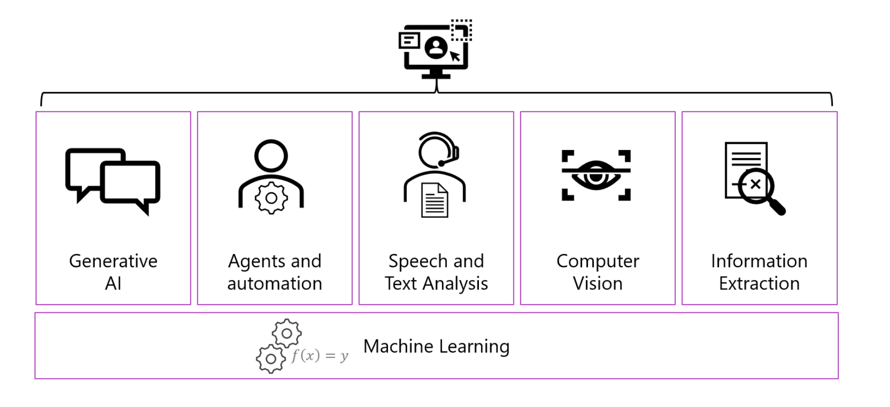

## Get started with AI in Microsoft Foundry

---

### What is an AI application?

**Artificial Intelligence** (AI) refers to systems designed to perform tasks that typically require human intelligence—such as reasoning, problem-solving, perception, and language understanding. Responsible AI: Emphasizes fairness, transparency, and ethical use of AI technologies.

---

### Types of ML

- _Supervised and Unsupervised Learning_: such as regression (supervised) for predicting prices, classification (supervised) for spam detection, and clustering (unsupervised) for customer segmentation.
- _Deep Learning_: A specialized branch of ML using neural networks with multiple layers for tasks like image recognition and speech synthesis. Deep learning provides the foundation through neural networks that learn complex patterns from massive datasets.
- _Generative AI_: uses deep learning capabilities to create new content—text, images, audio, code—rather than just classify or predict outcomes.

---

### Components of an AI application

- Data Layer;
- Model Layer;
- Compute Layer;
- Integration & Orchestration Layer;

---

### Microsoft Foundry for AI

**Microsoft Foundry** is a unified, enterprise-grade platform for building, deploying, and managing AI applications and agents.

Within Foundry's portal, you can work with:

- **Foundry Models**: Access to foundation and partner models (Azure OpenAI in Foundry Models, Anthropic, Cohere, etc.);
- **Agent Service**: Build and orchestrate multi-step AI workflows;
- **Foundry Tools**: Prebuilt Azure services (Vision, Language, Search, Document Intelligence);
- **Governance & Observability capabilities**: Centralized identity, policy, and monitoring for AI workloads;

---
