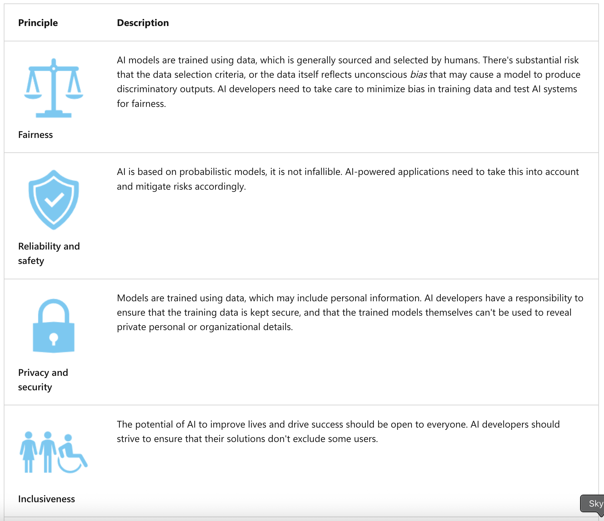
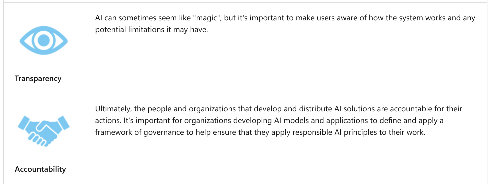

## Introduction to AI

---

### General information

Generative AI is a branch of AI that enables software applications to generate new content; often natural language dialogs, but also images, video, code, and other formats. The ability to generate content is based on a language model, which has been trained with huge volumes of data - often documents from the Internet or other public sources of information.

There are _large language models (LLMs)_ and _small language models (SLMs)_ - the difference is based on the volume of data and the number of variables in the model.

---

### Text and natural language

- Text classification;
- Key-term extraction and entity detection;
- Summarization;

---

### Speech

- Speech recognition (STT);
- Speech synthesis (TTS);

---

### Computer vision

- Image classification;
- Object detection;
- Semantic segmentation;
- Multi-modal models;

---

### Information extraction

- Optical Character Recognition (OCR);

---

### Responsible AI

---
