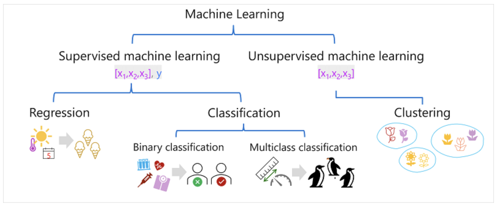

## Introduction to machine learning concepts

---

### Machine learning models

$y=(x)$ and $y^*$

- $x$ - the vector of features;
- $y$ - the label to predict;
- $y^*$ - the predicted label;

---

### Types of machine learning model

---

### Regression

Regression models are trained to predict numeric label values based on training data that includes both features and known labels.

Regression evaluation metrics:

- Mean Absolute Error (MAE):
  $MAE=\frac{1}{n} \sum_{i=1}^n |y_{i} - y^{*}_{i}|$

- Mean Squared Error (MSE):
  $MSE=\frac{1}{n} \sum_{i=1}^n (y_{i} - y^{*}_{i})^2$

- Root Mean Squared Error (RMSE):
  $RMSE=\sqrt{\frac{1}{n}\sum_{i=1}^n (y_{i} - y^{*}_{i})^2}$

- Coefficient of determination (R2)
  $R^2 = 1 - \frac{\sum_{i=1}^n (y_{i} - y^{*}_{i})^2}{\sum_{i=1}^n (y_{i} - y^{-})^2}$

---

### Binary classification

Classification, like regression, is a supervised machine learning technique; and therefore follows the same iterative process of training, validating, and evaluating models. Instead of calculating numeric values like a regression model, the algorithms used to train classification models calculate probability values for class assignment and the evaluation metrics used to assess model performance compare the predicted classes to the actual classes.

Binary classification evaluation metrics:

- Accuracy:
  $Accuracy=\frac{TN + TP}{TN + FN + FP + TP}$

- Recall:
  $Recall=\frac{TP}{TP + FN}$

- Precision:
  $Precision=\frac{TP}{TP+FP}$

- F1-score:
  $F1-score=\frac{2*Precision*Recall}{Precision + Recall}$

- Area Under the Curve (AUC) is _the ROC curve_;

---

### Multiclass classification

Multiclass classification is used to predict to which of multiple possible classes an observation belongs

---

### Clustering

Clustering is a form of unsupervised machine learning in which observations are grouped into clusters based on similarities in their data values, or features. This kind of machine learning is considered unsupervised because it doesn't make use of previously known label values to train a model. In a clustering model, the label is the cluster to which the observation is assigned, based only on its features.

Evaluating a clustering model:

- Average distance to cluster center;
- Average distance to other center;
- Maximum distance to cluster center;
- Silhouette;

---

### Deep learning

Deep learning is an advanced form of machine learning that tries to emulate the way the human brain learns. The key to deep learning is the creation of an artificial neural network that simulates electrochemical activity in biological neurons by using mathematical functions, as shown here.

---
