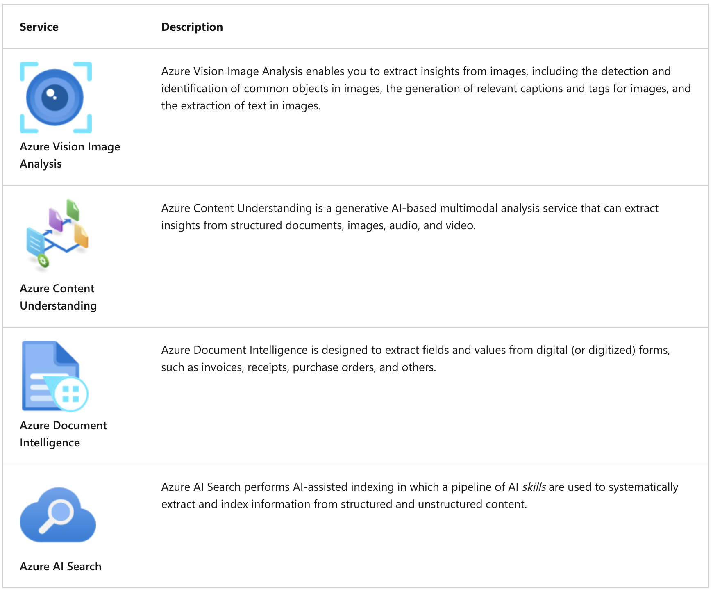

## Get started with AI-powered information extraction in Microsoft Foundry

---

### Azure AI services for information extraction

---

### Extract information with Azure Vision

1. Automated caption and tag generation;
2. Object detection;
3. Optical character recognition (OCR);

---

### Extract multimodal information with Azure Content Understanding

1. Analyzing forms and documents;
2. Analyzing audio;
3. Analyzing images and video;

---

### Extract information from forms with Azure Document Intelligence

1. Using prebuilt models;
2. Creating custom models;

---

### Create a knowledge mining solution with Azure AI Search

1. Indexers, indexes, and skills;
2. Persisting extracted data to a knowledge store;

---
