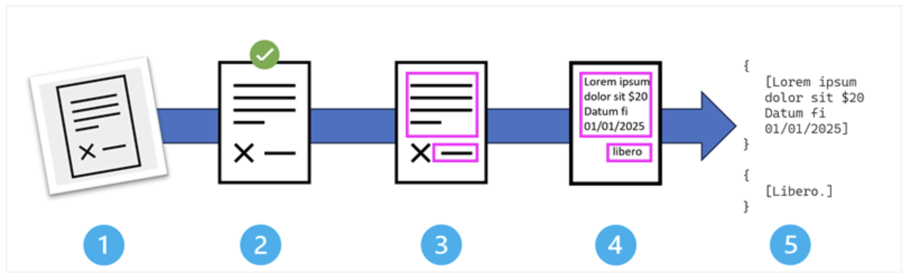
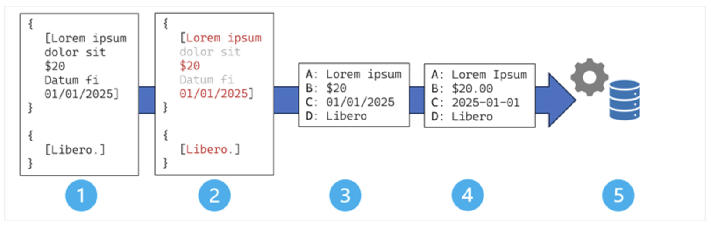

## Introduction to AI-powered information extraction concepts

---

### Overview of information extraction

A comprehensive information extraction solution involves elements of computer vision to detect text in image-based data; and machine learning, or increasingly generative AI, to semantically map the extracted text to specific data fields.

---

### Optical character recognition (OCR)

**The OCR pipeline: A step-by-step process**

The stages in the OCR process are:

1. Image acquisition and input;
2. Preprocessing and image enhancement;
3. Text region detection;
4. Character recognition and classification;
5. Output generation and post-processing;

---

### Field extraction and mapping

Field extraction is the process of taking text output from OCR and mapping individual text values it to specific, labeled data fields that correspond to meaningful business information. While OCR tells you what text exists in a document, field extraction tells you what that text means and where it belongs in your business systems.

The stages in the field extraction process are:

1. OCR output ingestion;
2. Field detection and candidate identification;
3. Field mapping and association;
4. Data normalization and standardization;
5. Integration with business processes and systems;

---
