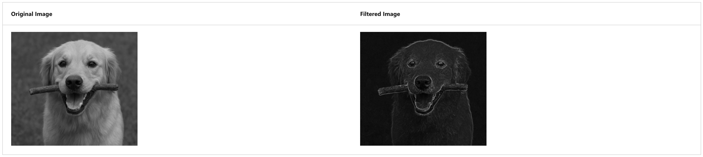

## Introduction to computer vision concepts

---

### Computer vision tasks and techniques

1. Image classification;
2. Object detection;
3. Semantic segmentation;
4. Contextual image analysis;

---

### Images and image processing

**!** A common way to perform image processing tasks is to apply filters that modify the pixel values of the image to create a visual effect.

---

### Convolutional neural networks

CNNs use filters to extract numeric feature maps from images, and then feed the feature values into a deep learning model to generate a label prediction.

---

### Image generation

Most modern image-generation models use a technique called _diffusion_, in which a prompt is used to identify a set of related visual features that can be combined to create an image. The image is then created iteratively, starting with a random set of pixel values and removing "noise" to create structure. After each iteration, the model evaluates the image so far to compare it to the prompt, until a final image that depicts the desired scene is produced.

---
