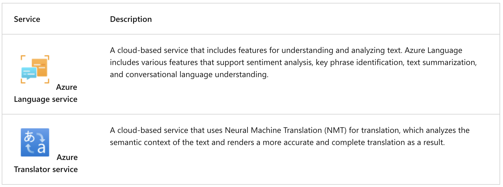

## Get started with natural language processing in Microsoft Foundry

---

### General information

---

### Azure Language's text analysis capabilities

**Azure Language** is a part of the _Foundry Tools_ offerings that can perform advanced natural language processing over unstructured text. Azure Language's text analysis features include:

- **Named entity recognition** identifies people, places, events, and more. This feature can also be customized to extract custom categories;
- **Entity linking** identifies known entities together with a link to Wikipedia;
- **Personal identifying information (PII)** detection identifies personally sensitive information, including personal health information (PHI);
- **Language detection** identifies the language of the text and returns a language code such as "en" for English;
- **Sentiment analysis** and opinion mining identifies whether text is positive or negative;
- **Summarization** summarizes text by identifying the most important information;
- **Key phrase extraction** lists the main concepts from unstructured text;

---

### Azure Language's conversational AI capabilities

Conversational AI describes solutions that enable a dialog between AI and a human:

1. Question answering;
2. Conversational language understanding;

---

### Azure Translator capabilities

Azure Translator includes the following capabilities:

1. **Text translation** - used for quick and accurate text translation in real time across all supported languages;
2. **Document translation** - used to translate multiple documents across all supported languages while preserving original document structure;
3. **Custom translation** - used to enable enterprises, app developers, and language service providers to build customized neural machine translation (NMT) systems;

---
