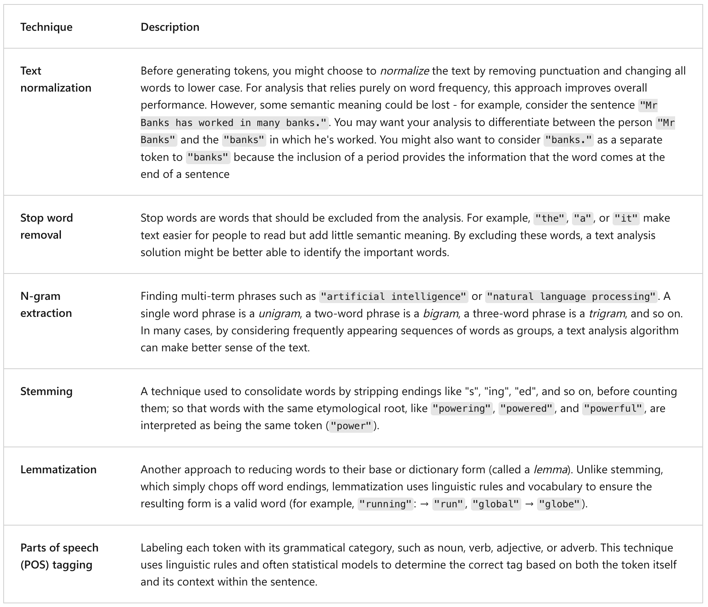

## Introduction to text analysis concepts

---

### General information

Some common use cases for text analysis include:

- Key term extraction;
- Entity detection;
- Text classification;
- Sentiment analysis;
- Text summarization;

---

### Tokenization

---

### Statistical text analysis.

1. Frequency Analysis;
2. Term Frequency - Inverse Document Frequency (TF-IDF);
3. "Bag-of-words" machine learning techniques;
4. TextRank;

---

### Semantic language models

Key approaches in SLM:

1. Representing text as vectors;
2. Finding related terms (`cosine_similarity(A, B) = (A · B) / (||A|| * ||B||)`);
3. Vector translation through addition and subtraction;
4. Analogical reasoning;
5. Using semantic models for text analysis;

---
