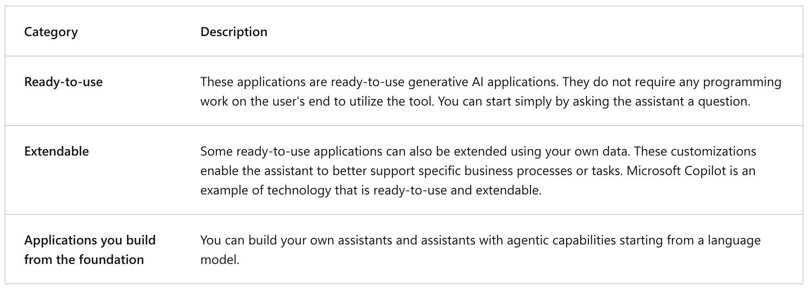
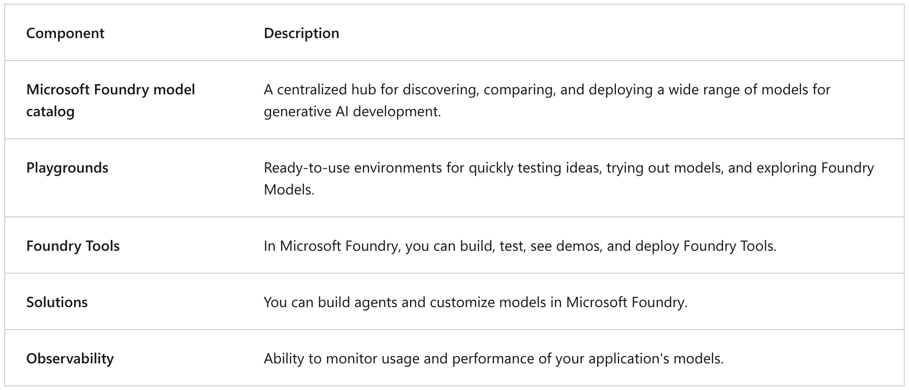
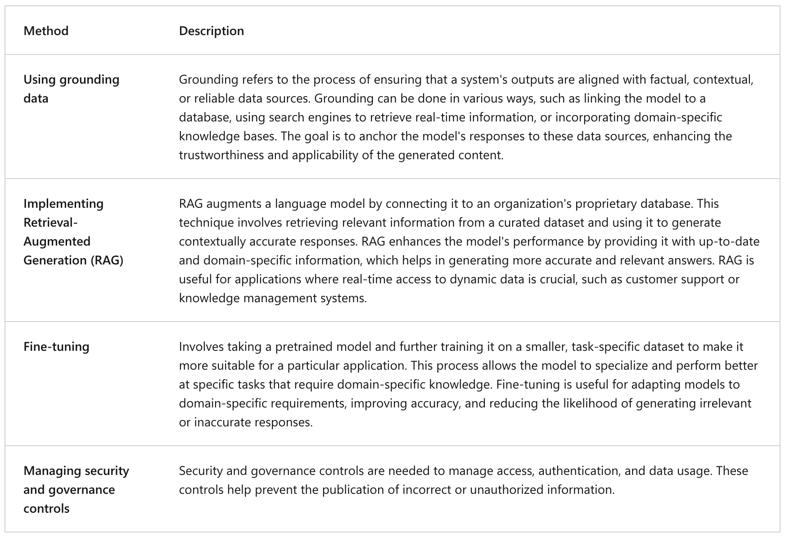

## Get started with generative AI in Microsoft Foundry

---

### General information

**Agents** are applications that can respond to user input or assess situations autonomously, and take appropriate actions.



---

### Generative AI development in Foundry



---

### Customizing models



---

### Code example:

```python
from openai import OpenAI


endpoint = "https://your-project-resource.openai.azure.com/openai/v1/"
deployment_name = "gpt-4.1-mini"
api_key = "<your-api-key>"

client = OpenAI(base_url=endpoint, api_key=api_key)

response = client.responses.create(
    model=deployment_name,
    input="What is the capital of France?",
)

print(f"answer: {response.output[0]}")
```

---
