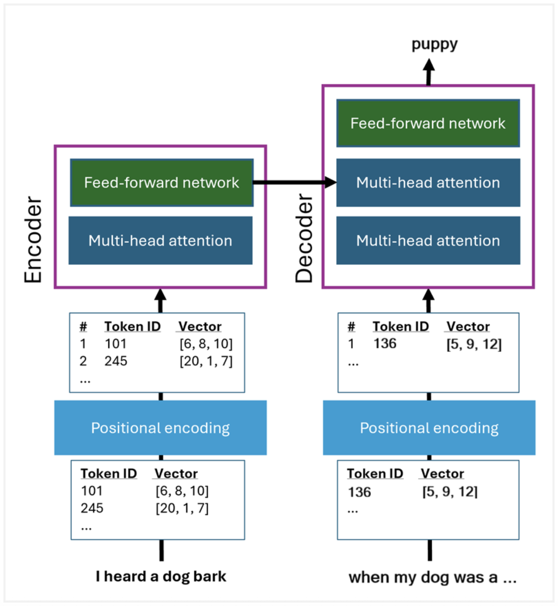
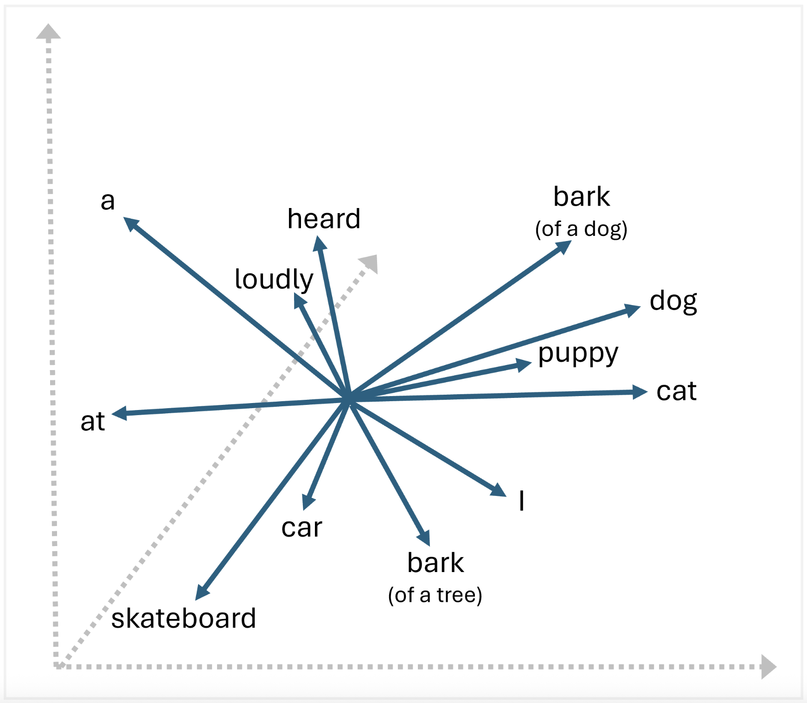

## Introduction to generative AI and agents

---

### Large language models (LLMs)

At the core of generative AI, large language models (LLMs) - and their more compact relations, small language models (SLMs) - encapsulate the linguistic and semantic relationships between the words and phrases in a vocabulary. The model can use these relationships to reason over natural language input and generate meaningful and relevant responses.

---

### Tokenization

While we tend to think of language in terms of words, LLMs break down their vocabulary into tokens. Tokens include words, but also sub-words (like the "un" in "unbelievable" and "unlikely"), punctuation, and other commonly used sequences of characters. The first step in training a large language model therefore is to break down the training text into its distinct tokens, and assign a unique integer identifier to each one.

---

### Transforming tokens with a transformer

---

### Attention and embeddings

Vectors in three-dimensional space:

---

### Prompts

A _prompt_ is simply the input you give to an LLM to get a response. It might be a question or a command, or just a casual comment to start a conversation. The model responds to a prompt with a _completion_.

Types of prompt:

- **System prompts** that set the behavior and tone of the model, and any constraints it should adhere to. For example, "You're a helpful assistant that responds in a cheerful, friendly manner.". System prompts determine constraints and styles for the model's responses.
- **User prompts** that elicit a response to a specific question or instruction. For example, "Summarize the key considerations for adopting generative AI described in GenAI_Considerations.docx for a corporate executive. Format the summary as no more than six bullet points with a professional tone.".

---

### Retrieval augmented generation (RAG)

To add even more context, generative AI applications can use a technique called _retrieval augmented generation (RAG)_. This approach involves retrieving information, like documents or emails, and using it to augment the prompt with relevant data. The response generated by the model is then _grounded_ in the information that was provided.

---

### AI agents

AI agents have three key elements:

- **A large language model**;
- **Instructions**;
- **Tools**;

---
